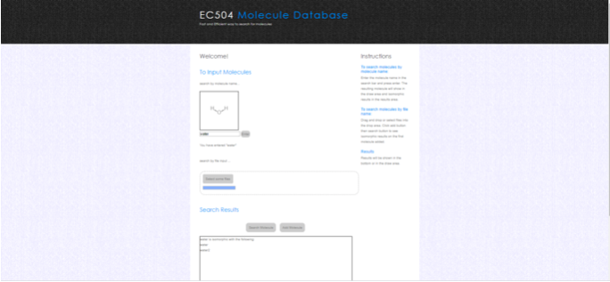

# Molecule Database
# Group 9

# Documentation:
In this project, we will be exploring ways to efficiently store and access molecular data through undirected multigraphs. We will be using the atomic makeup of molecules and their molecular properties to help us achieve this task. The challenge in doing so is that as the graphs grow in size, there is a factorial complexity involved with inefficiently trying to locate our molecule. Likewise, there are difficulties in inserting new data in such a way so that we keep the molecules organized for future consumption. This becomes an NP problem. Our group is attempting to explore the labelings and neighbor connections as best as possible in order to reduce the overall computation involving isomorphic graphs.

## Group Members

- Andreas Francisco: andoliv@bu.edu

- Esteban Hernandez: hesteban@bu.edu

- Timmy Hoang: hoangt@bu.edu

- Danny Trinh: djtrinh@bu.edu

- Edwin Sun: edsun@bu.edu

## Description of the implementation

- Search Algorithm:

    - The first part of the function is checking if there exists a mapping from vertices in the original molecule to the other molecule where the labelings of the mapping might not be unique therefore we denote this as a “weak” isomorphism. The purpose of this was to use it as a pre filter for the stronger isomorphism case, since the latter problem that O(V^3*logV*V!) while the “weak isomorphism” problem online takes O(V^3*log(V)) in the worst case. Therefore if the molecules aren’t weakly isomorphic then they aren’t isomorphic so the algorithm halts and outputs that. The data structure used to confirm this are an adjacency matrix along with ArrayLists. We used adjacency_matrices because we wanted to be able to use the constant lookup time involved in detecting edges while if we resorted to an adjacency list we would have needed to parse the list every time we wanted to detect if an edge connected two vertices.
    - The first part of finding the unique mapping is identifying the vertices that might generate an error (we call these the ambiguous vertices in the code). These ambiguous vertices are the set of vertices that have the same source atom and same outgoing connections from the source atoms and the reason why they might generate an error is related to the fact that two molecules may be weakly isomorphic while they are not strongly isomorphic because of these ambiguous atoms. An example is left as a unit test in graphIsomorphism test. The second part is creating the correspondence between the two molecules we are comparing (a correspondence means: if we were running the weak code what would vertex n from molecule 1 be mapped to in molecule 2).  After finding the correspondence, we label the two molecules with unique labels such that if molecule 1 vertex n has a certain label then the corresponding vertex in molecule 2 is labeled that way and no other vertex in the 2nd molecule is labeled the same way. Given this labeling we eliminate all the ambiguous molecules and essentially create a bijection. In order to verify that there is a possibility of isomorphism we need to make all possible labelings. We turned to Heap’s Algorithm for that which is a recursive way to generate all possible labelings from a set. (For a more descriptive explanation refer to code)
    - The relevant data structures for the implementation of graph isomorphism were adjacency matrices implemented as two dimensional integer arrays, arrayLists of pairs,strings, integers, a hash set was used for the tracking of ambiguous atoms along with a stack to store the possible solutions while making the permutations of the ambiguous atoms (refer to code for a more detailed explanation). 
    
- Database:
    - Using the H2 Database Engine as our database manager. 
    - Created 3 tables for molecules, atoms, edges
    
    
    
    - In the Molecules table, each row holds a single molecule with columns: name and num_atoms.
    - In the Atoms table, the mid field is a foreign key which we use to relate the vertex id and atom name to a specific molecule. Several rows in the Atoms table can be related to a single molecule.
    - In the Edges table, the mid field is also a foreign key which we use to relate the edge of one vertex to another vertex of the same molecule. Several rows in the Edges table can be related to a single molecule.
    - We chose this design because we wanted to comply with First Normal Form. No row in atoms contains more than one atoms and no row in edges contains more than one edge.
    - To query a molecule’s adjacency list or matrix, we perform multiple joins and self joins across the 3 tables to construct the adjacency lists.

## List of Features

   
   

- Implemented:
    
    - Develop a web page and corresponding server-side executable for accessing the database
    (The web framework used is a Java framework similar to Flask called Javalin. POST and GET functions are called along with Ajax calls to communicate to and from the server. Users can add molecules to the H2DB database and search for isomorphism by name or by file.)

    - Ability to handle core operations on a database of at least 10 million molecules at a rate of 10 operations per second on a lab computer.
    We randomly created 10 million molecules of 3 to 8 atoms. You can use the database with the command ./md --insertTenMillion. In our unit test, SmallSystemsTest.java, we test the time required to add 10 carbon molecules and check if that time elapsed is less than 1 second. We also do 10 "find" operations of the carbon molecule. The add command is a simple SQL query that inserts the molecule into our database. The find command will first query all molecules that have the same number of atoms and have the same type of atoms as the input molecule. Then we run our isomorphism algorithm described in the previous section.

    - Ability to search for the most similar molecule to a given molecule, if an exact match does not exist, under some reasonable graph similarity metric.
    (The relevant data structures for the similar are the same as the Graph Isomorphism code. We used an adjacency matrix to get the smallest edge distance calculation and an array list to get the vertex distance.)

- Additional New Features Implemented:

    - Download 1,000 known compounds from an existing database (e.g., ChemSpider) into your molecular database. We downloaded molecules using the PubChem API.
    (We decided that having meaningful compounds in our database would improve various different aspects of the user experience. Having known compounds, we are able to look up bond information (X-Y coordinates) to plot various locations of atoms. The implementation is done by restful API calls to pubChem as opposed ChemSpider. ChemSpider did not have the bond information we needed for drawing molecules. Every result is obtained and parsed in JSON format.)
    -Java GUI that provides molecular entry and search capabilities. it also displays molecules in graphical format and database statistics.

## References

Datta, S., Limaye, N., & Nimbhorkar, P. (2008). 3-Connected Planar Graph Isomorphism Is in Log-Space. Leibniz International Proceedings in Informatics, LIPIcs, 2, 155–162. https://doi.org/10.1109/ccc.2009.16

 Pöial, Jaanus. (2003). Implementation of directed multigraphs in Java.. 163. 10.1145/957289.957337.

Abulaish, Muhammad, and Zubair Ali Ansari. "SubISO: A Scalable and Novel Approach for Subgraph Isomorphism Search in Large Graph." 11th IEEE International Conference on Communication Systems & Networks (COMSNETS), 2019.

Cordella, L. P., Foggia, P., Sansone, C., & Vento, M. (2004). A (sub)graph isomorphism algorithm for matching large graphs. IEEE Transactions on Pattern Analysis and Machine Intelligence, 26(10), 1367–1372. https://doi.org/10.1109/TPAMI.2004.75

Carletti, V., Foggia, P., Saggese, A., & Vento, M. (2018). Challenging the Time Complexity of Exact Subgraph Isomorphism for Huge and Dense Graphs with VF3. IEEE Transactions on Pattern Analysis and Machine Intelligence, 40(4), 804–818. https://doi.org/10.1109/TPAMI.2017.2696940

## WorkBreakdown

- Timmy Hoang:  A working SQL database that stores a molecule onto three tables where table one holds the molecule id, molecule name. Table two contains the molecule atom/vertex list. Table three contains the molecules adjacency list. Created the H2DB class that will be used to query and insert into the database. Designed a MoleculeAbstract, MoleculeText, MoleculeS classes that will be used depending on where the molecule will be parsed from. Also wrote Unit Tests for the database, and a small scale systems test. Integrated the database, search functions, and command line interface.

    As an addition of more features, I have implemented the JAVA GUI that includes outputs a graphic of the drawing of molecules and list of isomorphic molecules. It allows inputs that accepts file from current computer and two radio buttons for the add and find operations for the project. 

- Edwin Sun: Bash script that creates an executable file that adds a custom terminal command for adding and searching molecules. It needs to be saved in /usr/bin and be given appropriate permissions so that anybody using the terminal can execute the command. It error checks the parameters, options and filename if they exist. For each individual command, it runs a jar package for the search and add functions. 

    Also, I have created and designed the webUI with html (adds static page), css (adds style), and javascript (adds interactability). It accepts inputs by molecule name and file name. Molecule name is accepted into a search bar, and file can be dropped into the drag-and-drop area that will read the file into the database. Searching the molecules in the database is done locally via Javalin (implemented by Danny to work with the database). Once search is done, results are displayed in the draw area and results section. 
    

- Esteban Hernandez (inactive): Android app for user interface (not implemented).

- Andreas Francisco: Implemented an initial algorithm to determine whether molecules were “weakly” isomorphic. After the initial pre-filter step of “weak” isomorphism implemented a more rigorous search that verifies the isomorphism by creating all possible bijections between vertices of molecule 1 to vertices of molecule 2. The rigorous search has several steps and was described in the code and later on this report. Created simple unit tests and harder unit tests where “weak” isomorphism might hold between two molecules while isomorphism doesn’t. Created a metric for finding similar molecules. Implemented the metric to work with the database and find the most similar molecule in the database provided a given molecule which has the same number of atoms as the similar ones (for now). Implemented a small unit test for the find similar algorithm. Added some additional methods to MoleculeAbstract the child classes in order to provide more functionality for the isomorphism and find similar algorithms.

- Danny Trinh Extracting Compounds from the Internet: Completed extraction of a large number of compounds from pubChem. Creating Lewis dot structures is an approach to determining the molecular bond of atoms in compounds. Because of this, chemspider makes it difficult to determine the bond information without the Lewis dot structures. PubChem provides bond information through a JSON format for each compound. The databaseParser class grabs the JSON 2D representations of compounds, extracts the molecule name, atomic vertices mapping to periodicTable.csv, extraction of bond connections, and outputs the multigraph formatted file into a directory for SQL data processing. JSON in Java jar used.

    webUI backend integration: I worked primarily on the backend development of the webUI along with minor frontend webUI interfaces. This involved integration and implementation of the drawing of the molecules API (ChemDoodle), H2DB database operations, and the isomorphism search algorithm. Adding molecules into the data is done through asynchronous calls (Ajax) to the Java web interface framework (Javalin). Various different POST and GET calls are done from the webUI to the send information back and forth. Currently, any new molecule interaction with the webUI must be placed under the molecules/ directory because absolute paths of files are not easily obtainable with a web interface. Users can search for isomorphism by molecule name if it exists in the H2DB database. Users can also search for isomorphism by file or add new molecules to the H2DB data by files. My immediate task is to switch to collaborating with team members to improve the isomorphic search algorithm.
